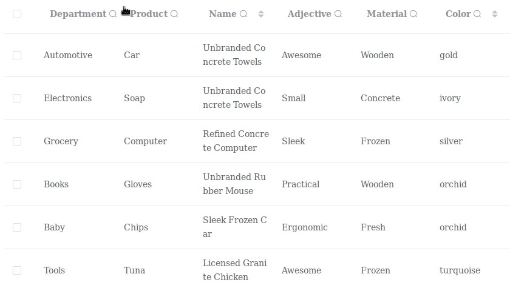

# vue-data-table-column

> A simple, customizable data table column based on vue2 and element-ui with essential features like sorting, column filtering etc.



## Features

- Popover filters. Supports: text, select, date range.
- Sorting and other features from el-table-column.

## Requirements

- [`element-ui`](https://www.npmjs.com/package/element-ui)
- [`lodash`](https://www.npmjs.com/package/lodash)
- [`vue2`](https://www.npmjs.com/package/vue)

## Installation

```bash
yarn add vue-data-table-column
```

## Usage

Include the component

```javascript
import DataTableColumn from 'vue-data-table-column';
```

Then, register the component, however you like:

```javascript
{
  ...
  components: {
    ...
    DataTableColumn
  }
}
```

or register globally:

```javascript
import ElementUI from 'element-ui';
import DataTableColumn from 'vue-data-table-column';
...
Vue.use(ElementUI);
Vue.use(DataTableColumn);
...
new Vue({
  el: '#app',
  render: h => h(App),
});
```

And then use the component:

```html
<template>
  <el-table>
    <data-table-column
      v-model="filter"
      :column-props="{ ...original el-table-column props... }"
      :filter-props="{ ...filter props... }"
    ></data-table-column>
  </el-table>
</template>
```

### Documentation

Available filter types:

- `text` or `input` - text filter
- `select` - dropdown filter
- `date` - date range filter
- `datetime` - date time range filter

Filter properties:

| Prop                | Type     | Default              | Description                                     |
| ------------------- | -------- | -------------------- | ----------------------------------------------- |
| type                | String   |                      | Filter type ('text','select','date','datetime') |
| data                | Array    |                      | Data for select filter [{label, value}]         |
| filterMethod        | Function |                      | Same as el-table-column filter method           |
| callbackMethod      | Function |                      | Call when v-model changed (column, prop, value) |
| placeholder         | String   |                      | Filter placeholder                              |
| width               | String   | 230px                | Filter popover width                            |
| icon                | String   | el-icon-search       | Field icon class                                |
| dateFormat          | String   | yyyy-MM-dd           | Date field display format                       |
| dateValueFormat     | String   | yyyy-MM-dd           | Date field value format                         |
| dateTimeFormat      | String   | yyyy-MM-dd HH:mm:ss  | Datetime field display format                   |
| dateTimeValueFormat | String   | yyyy-MM-dd HH:mm:ss  | Datetime field value format                     |
| defaultTime         | Array    | [00:00:00, 23:59:59] | Default time range for datetime field           |

## Authors

* [Alex Zet](https://github.com/zetdev)
<!--* [Other Contributors](https://github.com/vuext/vue-data-table-column/graphs/contributors)-->

## Contributions

All contributions are welcome send your PR and Issues.

## License

This project is licensed under the MIT License - see the [LICENSE](LICENSE) file for details.
